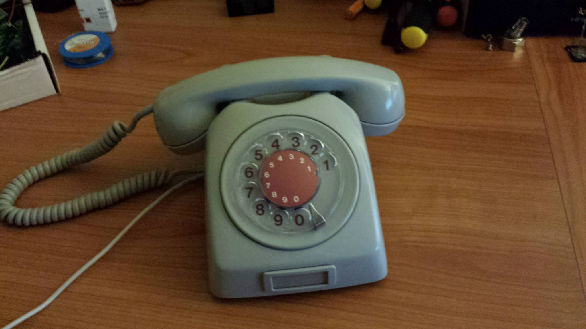

# Software for AS Elektrisk Bureau

This Python-script integrates the old rotary dial and handset on the 
AS Elektrisk Bureau pulse phone to use SIP. 

It uses GPIO on Raspberry Pi to communicate with the rotary dial, and
the onboard soundcard for ringtone. An USB-soundcard is used for mic
and handset audio. 

Some configuration on the Raspberry Pi is needed to make everything work, 
including installing the dependencies and configuring PulseAudio and ALSA
to enable software mixing of sounds. 

Linphone (linphonec for console) is also required because it handles the 
SIP-connection. 

There is some code to use Pjsip, but it's not finished. 

For more information on the build, see http://imgur.com/a/HECDL/.

